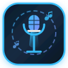

  <!-- Dusk & Midnight Hero Header -->
  

  

    🎧 <strong>Certified Vibe Coder</strong> 
    <i>"Works on my machine — if it breaks on yours, that's on you."</i>
  

  <!-- Quick Social Badges -->
  

    
  

---

<h3 align="center">⚡ My Tech Stack</h3>

  

---

<h3 align="center">📌 Featured Creations</h3>

####  DuskCore — TaskbarHero Utility

  
  

    
  

> **`VIBE CHECK`**  
> *Why grind 100 hours of clicks when you can politely persuade runtime memory you're a god? An ergonomic favor to your mouse switches.*

- 📖 **`ABOUT`**: High-performance automation companion and memory trainer for the idle game **TaskbarHero**. Instead of grinding hundreds of hours of manual clicking and waiting through repetitive crafting timers, players run DuskCore to automate 9-item gear synthesis, auto-open chests, unlock all DLC heroes & pets, and dynamically fine-tune combat stats (Attack, Move Speed, Crit, HP, and Cooldowns). Engineered with custom x86 assembly hooks within 2GB bounds and IL2CPP memory patching to bypass in-game ACTk anti-cheat checks seamlessly in real time.
- 🗡️ **`CLASS / TECH`**: `Flutter Desktop` &bull; `Dart` &bull; `C# (.NET)` &bull; `IL2CPP Hooking` &bull; `x86 Assembly`
- 💻 **`PLATFORMS`**: `[ Windows Desktop ]` &bull; `[ Web Application ]`
- 🌐 **`PORTAL URL`**: [duskcore.makizz.studio](https://duskcore.makizz.studio)
- 📦 **`SOURCE CODE`**: [`mhartkhiss/duskcore_flutter`](https://github.com/mhartkhiss/duskcore_flutter) 🔒 *(Private Repository)*

 

####  MKZ Karaoke — Real-Time Party Songbook & Player

  

> **`VIBE CHECK`**  
> *Zero fighting over sticky TV remotes—scan the QR, queue anthems straight from your phone, and sing like the neighbors don't exist.*

- 📖 **`ABOUT`**: Real-time collaborative karaoke platform built to eliminate the chaos of wrestling over a remote control or crowding around a TV screen. A host launches the central session on a living room TV or laptop to handle video streaming and playback controls, while friends and party guests instantly scan the on-screen QR code from their phones to search YouTube & curated catalogs, queue up their favorite anthems, and follow the playlist live. Built with Firebase Realtime Database for instantaneous state synchronization across all connected devices and automated multi-key YouTube API rotation to guarantee non-stop playback.
- 🗡️ **`CLASS / TECH`**: `React 19` &bull; `Vite` &bull; `Firebase Realtime Database` &bull; `Tailwind CSS` &bull; `Material UI` &bull; `Framer Motion` &bull; `YouTube Data API v3`
- 💻 **`PLATFORMS`**: `[ Web Application (Host Screen) ]` &bull; `[ Mobile Web (Guest Songbook) ]`
- 🌐 **`PORTAL URL`**: [mkzkaraoke.netlify.app](https://mkzkaraoke.netlify.app)
- 📦 **`SOURCE CODE`**: [`mhartkhiss/MKZ-karaoke`](https://github.com/mhartkhiss/MKZ-karaoke) 🔒 *(Private Repository)*

 

#### 🚀 Other Notable Projects

| Project | What it actually is | Vibe Check |
| :--- | :--- | :--- |
| **SpeakForge** | Capstone voice & speech synthesis platform with real-time server intelligence. | *It speaks, it listens, and honestly communicates better than most groupmates.* |
| **HealthConnect** | Full-scale healthcare appointment scheduling platform with real-time doctor rosters. | *Cures everything except the bugs I introduced at 3:15 AM.* |
| **MKZ Music** | Cross-platform desktop audio player and offline music management hub. | *Built specifically so I can legally vibe and listen to high-fidelity audio while debugging.* |
| **Equicon & ARC** | Administrative management & student requirements tracking systems. | *Automating deadline tracking so I can procrastinate with statistical precision.* |
| **RouteSage & Longride GPS** | Route planning and telemetry tracking app for rides and navigation. | *Finds the quickest escape route when a merge conflict appears in production.* |

